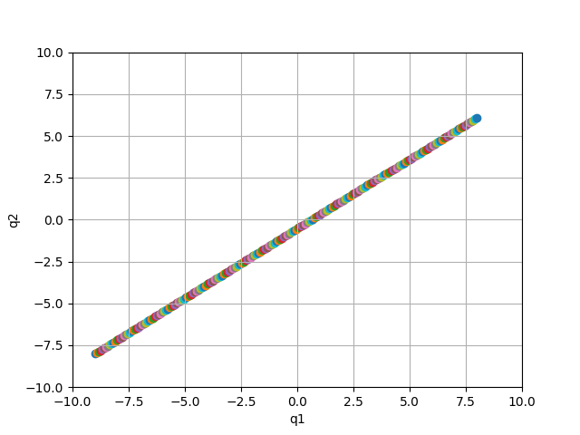
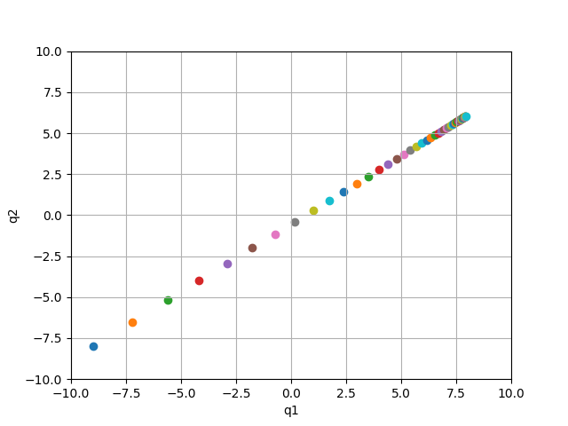
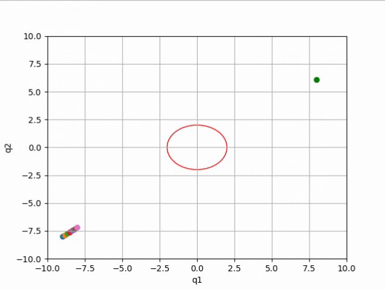

# PathPlanning_Learning

## Potential Fields
### Conic Attractive Potential

### Quadratic Attractive Potential

### Combination of Conic and Quadratic Attractive Potentials

### Attractive and Repulsive Potential functions
